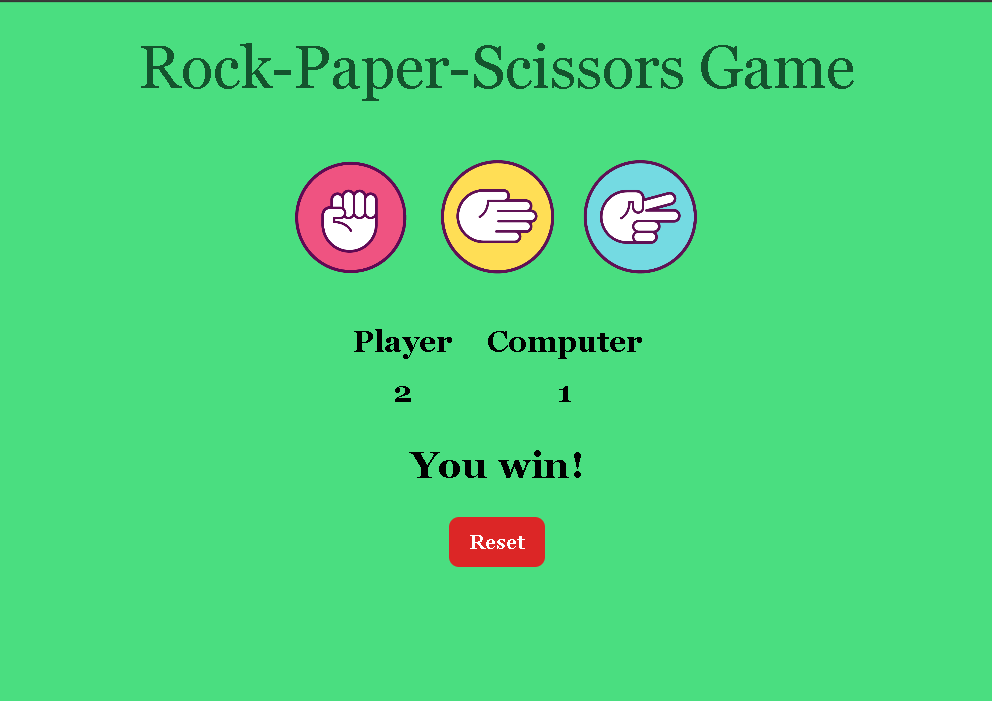

# 🎮 Rock-Paper-Scissors Game – Day 16 of Web Dev Journey

This is a simple **Rock-Paper-Scissors** game built using HTML, Tailwind CSS, and JavaScript.  
It was created as part of my **Web Development Learning Journey – Day 16**, focusing on core JavaScript skills.

## 💡 Features
- Clickable buttons for Rock, Paper, and Scissors (styled with background images)
- Randomized computer choice on each round
- Scoreboard that tracks Player and Computer scores
- Real-time game result messages (win/lose/draw)
- Reset button to restart the game

## 🛠️ Tech Stack
- **HTML** – Markup structure
- **Tailwind CSS** – Styling and layout
- **JavaScript** – Game logic and DOM manipulation

## 📸 Screenshot

## 📁 Project Setup
No installation needed — just open `index.html` in your browser.

## 🤝 Contributions
Suggestions or improvements are welcome! You can fork this repo and create a pull request.

---

Created with 💻 by T. Akshitha

