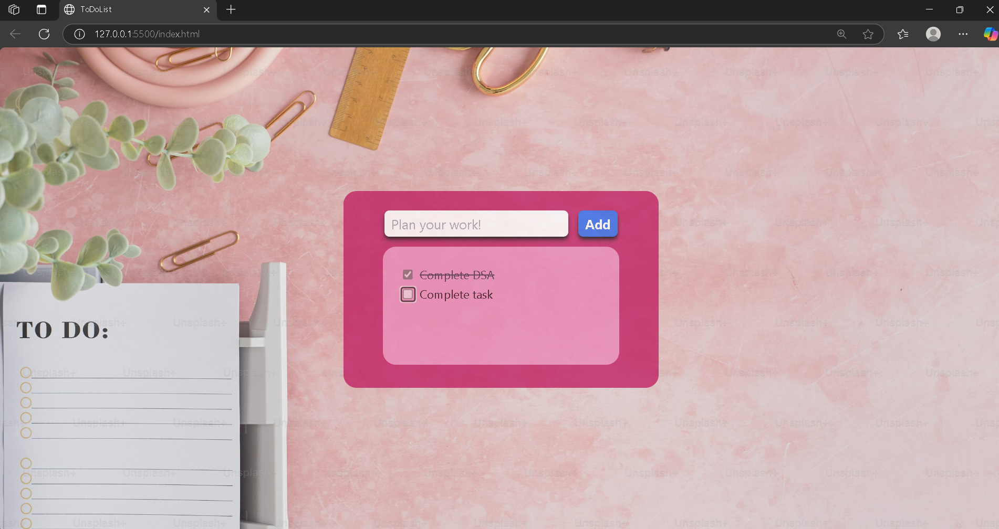

# 📝 ToDo List App - Day17 of WebDev challenge!

A simple and responsive ToDo List web application built using **HTML**, **Tailwind CSS**, and **Vanilla JavaScript**. Created as part of my **Web Development Challenge – Day 17**.

---

## 🚀 Features

- ➕ Add new tasks by clicking the **Add** button or pressing **Enter**
- ✅ Mark tasks as complete using checkboxes
- 🧹 Strikethrough effect for completed tasks
- 🖌️ Stylish and responsive UI using **Tailwind CSS**
- 🎯 Clears the input automatically after task is added

---

## 🎨 Tech Stack

- **HTML5**
- **Tailwind CSS**
- **Vanilla JavaScript**

---

## 📸 Preview

## Open index.html in your browser.

