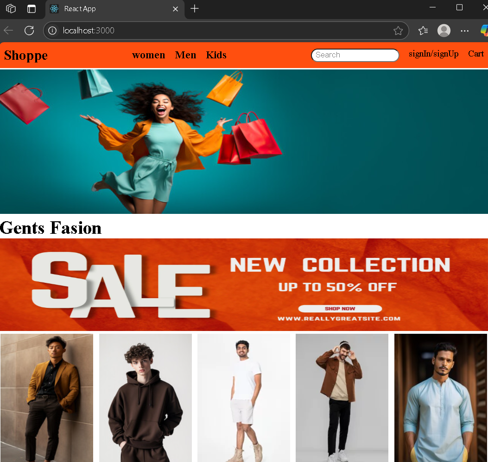

# 🛍️ React Shopping Website – Day 23 Project

This project is part of my **WebDev challenge** challenge. On **Day 23**, I implemented a simple shopping website using all the React concepts I’ve learned so far.

## 🚀 Features

- Component-based architecture
- Functional components
- Props and state management with `useState`
- Event handling
- Dynamic rendering of product collections
- Organized folder structure for scalability

## 🛠️ Technologies Used

- React.js
- JavaScript (ES6+)
- CSS (Basic styling, no Tailwind used)

## 🧠 What I Learned

- How to use props and state effectively
- Rendering components conditionally
- Organizing reusable code in a component structure
- Debugging React rendering and import/export issues

## 📸 Screenshot

  

---

Let me know if you want it customized with your actual GitHub repo link or your LinkedIn URL.
