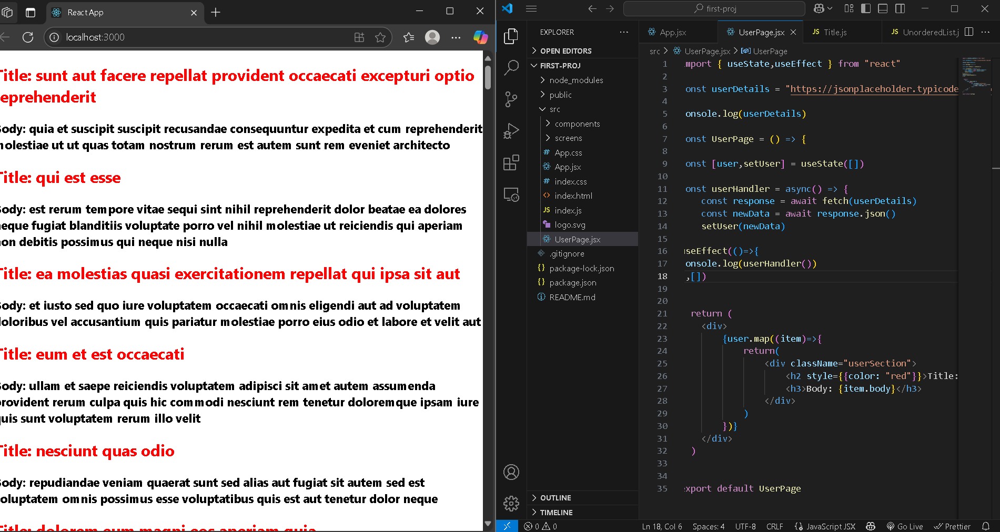

# 🚀 React Day 24 – WebDev Challenge - Fetching & Displaying API Data

Welcome to Day 24 of my React learning journey! Today’s focus was on understanding how to fetch data from an external API and display it dynamically in a React application.

---

## 📌 What I Learned

- How to make HTTP requests in React using `fetch`
- Using `async` and `await` to handle asynchronous data
- React Hooks: especially `useState` to store data and `useEffect` to load data when the component mounts
- How to iterate over API data using JavaScript’s `map` method and display it in the browser

---

## 🧠 Concepts Covered

- **API (Application Programming Interface):** A tool for communication between software systems
- **Asynchronous JavaScript:** Understanding how data is fetched without blocking the browser
- **React’s useEffect Hook:** Executes code (like fetching data) when the component is rendered
- **React’s useState Hook:** Stores and manages dynamic data inside the component
- **Dynamic Rendering:** Displaying lists of data in the browser using `.map()`

---

## 🌐 What I Built

I created a small React component that:
- Connects to a public API
- Fetches a list of posts
- Stores that data
- Loops through it to render each post on the screen

This helped me understand how real-time data flows into a React UI.

---

## 🎯 Next Goals

- Add a loading spinner and error handling
- Improve styling with Tailwind CSS
- Try fetching different types of data (users, photos, etc.)
- Learn how to send data (POST requests)

---

## 🛠 Tools Used

- React.js (with Vite)
- JSONPlaceholder API
- JavaScript ES6+ (Async/Await, Map)
- Browser Console (for debugging)

---

## 📸 Screenshot

---

