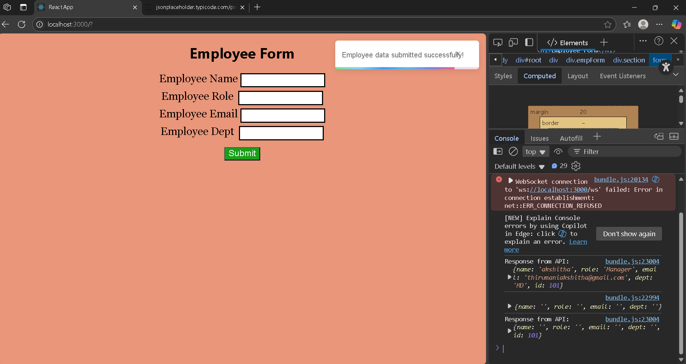

# 🚀 React Employee Form – Day 25 of WebDev Learning

This is a simple React app that demonstrates how to create a controlled form, send data to a dummy API, and show real-time toast notifications upon form submission.

## 📌 Features

* Employee data form with fields: Name, Role, Email, and Department
* Form submission with `fetch()` to a dummy API (JSONPlaceholder)
* Toast notifications using [React-Toastify](https://fkhadra.github.io/react-toastify/introduction)
* Auto-clear form fields after successful submission

## 🧪 Technologies Used

* React
* JavaScript (ES6+)
* [react-toastify](https://www.npmjs.com/package/react-toastify)
* JSONPlaceholder (as mock API)

## 🚚 How to Run the Project

1. Clone the repo or create a new React project
2. Install dependencies:

   ```
   npm install react-toastify
   ```
3. Start the project:

   ```
   npm start
   ```

## 📝 How It Works

* Users enter data in the input fields.
* On form submission, the data is sent to `https://jsonplaceholder.typicode.com/posts` using a POST request.
* A toast notification is shown upon success.
* The form resets after submission.

## 📦 Package Used

### react-toastify

> A lightweight toast notification library for React. It helps show quick messages (like alerts) without interrupting the user flow.

Install it with:

```
npm install react-toastify
```

## 📸 Screenshot




---
