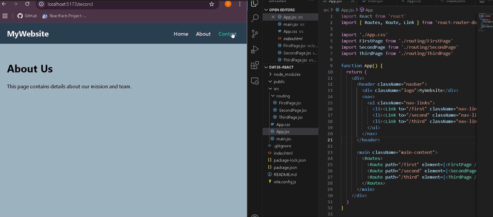

# 🚀 Day 26 – Navigation Bar with React & React Router

This project is part of my #100DaysOfCode challenge. On Day 26, I built a **functional navigation bar** using **React** and **React Router DOM** to simulate routing between pages in a web application.

---

## 🔧 What I Worked On

- Created a clean top navigation bar using `Link` components
- Routed between multiple pages using `Routes` and `Route`
- Designed a simple layout using `App.css`
- Used `BrowserRouter` to wrap the application in a routing context

---

## 💡 What I Learned

- How to maintain a consistent UI across multiple pages
- Styling active navigation links for a better user experience
- The importance of organizing components for scalable code
- How React Router handles client-side navigation

---

## 🛠 Tech Stack

- React
- React Router DOM
- CSS (App.css)

---

## 📸 Preview

---

## 🚀 Getting Started

To run this project locally:

1. Clone the repository:
2. Install the dependencies:
npm install
3. Start the development server:
npm start

