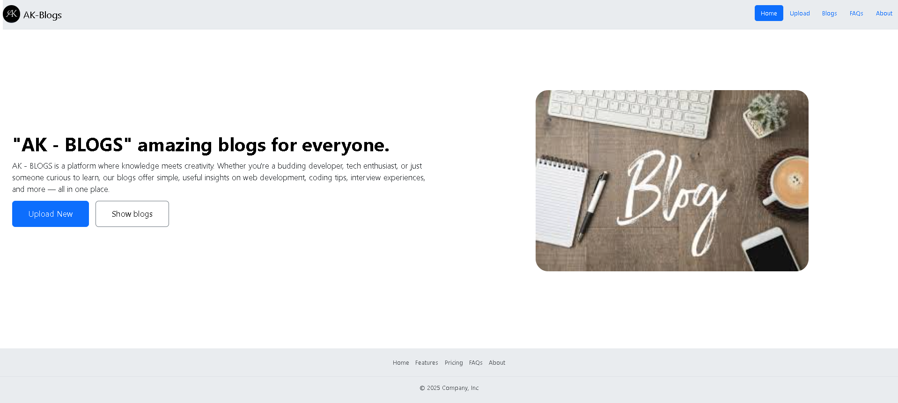

# AK-Blogs 📝

**AK-Blogs** is a simple and elegant blogging platform built using **Node.js**, **Express.js**, and **EJS** templating. It allows users to compose, publish, and read blog posts in a clean, responsive interface powered by **Bootstrap 5**.

---

## 🌟 Features

- 🏠 Home page with site overview
- 📝 Post page to create new blogs
- 📚 Show page listing all blogs
- 🔍 "Continue Reading" option to view full blog content
- ❓ FAQ and About pages
- 🖼️ Fully responsive layout using Bootstrap 5

---

## 🚀 Technologies Used

- [Node.js](https://nodejs.org/)
- [Express.js](https://expressjs.com/)
- [EJS](https://ejs.co/)
- [Bootstrap 5](https://getbootstrap.com/)
- [Body-Parser](https://www.npmjs.com/package/body-parser)

---

## 🔧 Installation

1. Clone the repository
2. Install dependencies
3. Run the app : node index.js
4. Open your browser and visit:
http://localhost:3000

# Screenshort

## ✍️ Author
Thirumani Akshitha
Follow me on LinkedIn