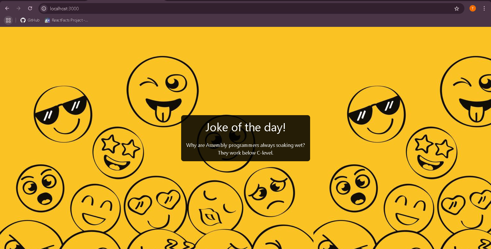

# Day 37 ofWebDev challenge!

# 😂 Joke of the Day – Capstone Project

A fun and simple web application that fetches random jokes using an **external API** and tested it on **postman** and displayed with clean styling using **Tailwind CSS**.

## 🚀 Features

- Fetches random jokes from [JokeAPI](https://v2.jokeapi.dev)
- Handles both **single-line** and **two-part** jokes (setup + delivery)
- Styled with **Tailwind CSS** using a fun background pattern
- Uses **Express.js**, **Axios**, and **EJS** templating
- Graceful error handling if the API fails


## 🛠️ Tech Stack

- **Node.js**  
- **Express.js**  
- **EJS** for templating  
- **Axios** for API requests  
- **Tailwind CSS** for styling (CDN version)


## 🧠 How It Works

1. On visiting `/`, the app makes a request to the JokeAPI.
2. If the joke is of type `"single"`, it renders the one-liner.
3. If it’s of type `"twopart"`, it displays the setup and delivery.
4. Tailwind adds a styled background and typography for a fun look.

## 📦 Installation

```bash
git clone https://github.com/Thirumani-Akshitha/Udemy-Complete-Web-Development-Course-Practice-Projects/tree/main/Day37-CapstoneProject-API-intigration

npm install
node index.js

Then open your browser and go to:
http://localhost:3000
```

## Screenshort



---

✨ Future Enhancements
Add a refresh button to load a new joke without reloading the page

Add dark mode with Tailwind theme switching

Deploy on Render/Vercel
